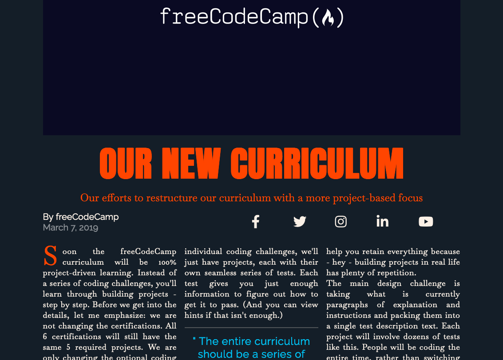
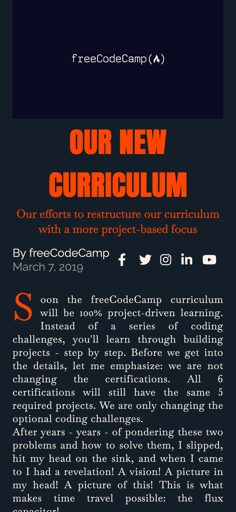

# Magazine Page

This repository contains the HTML and CSS for the **Learn CSS Grid by Building a Magazine** course by [freeCodeCamp](https://www.freecodecamp.org/learn/2022/responsive-web-design/).

CSS Grid gives control over the rows and columns of a webpage design.

The `index.html` file contains HTML tags and appropriate classes to use to structure and manipulate the elements on the page.

The `css/styles.css` file is used with an emphasis on CSS Grid. The project allows one to learn how to use CSS Grid, including concepets like grid rows and grid columns, to build a magazine article page.

The page can be viewed here: [Magazine](https://remicoding.github.io/magazine-page/)

For your convenience, here are screenshots of the page:

- Large screen webpage:
  

- Small screen webpage:
  
